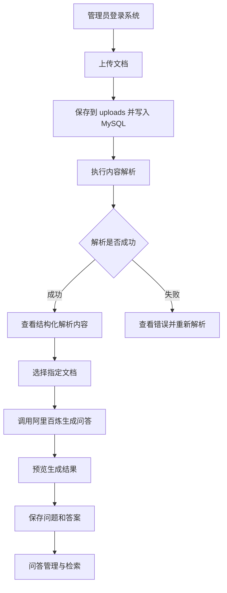

## 1. 产品概述
文档解析问答管理系统用于上传 PDF、PPT、Excel 等业务文档，自动识别文档内容，并基于文档内容生成可管理的问题与答案。
- 主要解决企业或团队文档内容难以检索、难以沉淀为知识问答的问题，目标用户包括知识库管理员、运营人员、客服团队、培训人员和业务专家。
- 产品价值在于将非结构化文档转化为结构化知识资产，降低人工整理 FAQ、培训题库和知识库问答的成本。

## 2. 核心功能

### 2.1 用户角色
| 角色 | 注册方式 | 核心权限 |
|------|----------|----------|
| 管理员 | 初始账号或后台创建 | 文档上传、解析管理、问答生成、问答编辑、删除和导出 |
| 普通用户 | 管理员创建或预留扩展 | 浏览文档解析内容、查看问答、按权限检索知识 |

### 2.2 功能模块
1. **工作台首页**：数据概览、最近上传文档、解析状态统计、问答数量统计、快捷上传入口。
2. **文档管理页**：上传文档、查看文档列表、解析状态、解析文本、重新解析、删除文档。
3. **文档详情页**：查看文档元信息、分页或分段解析内容、解析错误信息、关联问答列表。
4. **问答生成页**：选择指定文档、配置生成数量和生成方式，调用阿里百炼大模型生成问题答案，支持预览与保存。
5. **问答管理页**：按文档、关键词、状态筛选问答，编辑问题、答案、标签、启用状态，支持删除和批量操作。
6. **系统设置页**：配置文档大小限制、允许的文档类型、问答生成参数和模型服务地址。

### 2.3 页面详情
| 页面名称 | 模块名称 | 功能描述 |
|----------|----------|----------|
| 工作台首页 | 数据卡片 | 展示文档总数、解析成功数、解析失败数、问答总数 |
| 工作台首页 | 最近动态 | 展示最近上传、解析完成、生成问答的记录 |
| 文档管理页 | 上传区域 | 支持 PDF、PPT、PPTX、XLS、XLSX 文件上传，文件直接保存到后端 uploads 目录 |
| 文档管理页 | 文档列表 | 展示文件名、类型、大小、解析状态、上传时间、问答数量和操作入口 |
| 文档详情页 | 基础信息 | 展示文件名称、类型、大小、页数或工作表数量、解析耗时 |
| 文档详情页 | 解析内容 | 按章节、页面、工作表或段落展示识别后的文本内容 |
| 文档详情页 | 关联问答 | 展示该文档已生成的问题和答案，支持跳转编辑 |
| 问答生成页 | 文档选择 | 从已解析成功的文档中选择目标文档 |
| 问答生成页 | 生成配置 | 设置生成问题数量、问题难度和是否覆盖已有问答 |
| 问答生成页 | 结果预览 | 展示由阿里百炼生成的待保存问题、答案、来源片段和置信度 |
| 问答管理页 | 筛选查询 | 支持按文档、关键词、标签、启用状态和生成时间筛选 |
| 问答管理页 | 问答编辑 | 支持修改问题、答案、标签、备注和状态 |
| 系统设置页 | 参数配置 | 管理文件大小限制、解析开关、生成参数和服务配置 |

## 3. 核心流程

管理员进入系统后，在文档管理页上传 PDF、PPT 或 Excel 文档。后端将原始文件直接保存到 uploads 目录，并在 MySQL 中创建文档记录。后端执行文档解析任务，将解析出的文本内容按页面、幻灯片或工作表进行结构化存储。解析完成后，管理员可以进入文档详情页查看识别内容，也可以在问答生成页选择指定文档并调用阿里百炼大模型生成问题与答案。生成结果先进入预览状态，管理员确认后保存到问答库，并可在问答管理页持续编辑、启用、停用或删除。本地部署使用 docker-compose 编排前端、后端和 MySQL。

## 4. 用户界面设计

### 4.1 设计风格
- 主色采用深海蓝与石墨黑，辅助色采用电光青和暖橙，用于表达文档智能处理和知识流动感。
- 按钮使用轻量圆角矩形，主按钮高对比渐变，危险操作使用克制红色描边。
- 桌面端字体以清晰理性的无衬线字体为主，标题使用更有技术感的字重变化，正文强调可读性。
- 布局采用桌面优先的后台管理结构：左侧导航、顶部操作区、主内容卡片和表格组合。
- 图标风格使用线性图标，围绕文档、解析、知识节点、问答气泡等概念展开。

### 4.2 页面设计概览
| 页面名称 | 模块名称 | UI 元素 |
|----------|----------|---------|
| 工作台首页 | 数据概览 | 大号数字卡片、趋势角标、解析状态环形图、最近动态时间线 |
| 文档管理页 | 上传与列表 | 拖拽上传卡片、状态标签、文件类型徽标、操作下拉菜单 |
| 文档详情页 | 内容阅读 | 左侧文档结构目录、右侧解析文本卡片、来源段落编号 |
| 问答生成页 | 配置面板 | 文档选择器、参数滑块、生成按钮、结果预览卡片 |
| 问答管理页 | 数据表格 | 搜索栏、筛选器、可编辑抽屉、批量操作工具条 |
| 系统设置页 | 配置表单 | 分组表单、开关、输入框、保存提示 |

### 4.3 响应式
采用桌面优先设计，主要适配 1366px 及以上后台管理场景；平板宽度下左侧导航收起为图标栏；移动端保留核心浏览、搜索和编辑能力，上传和批量管理操作简化为纵向表单。
