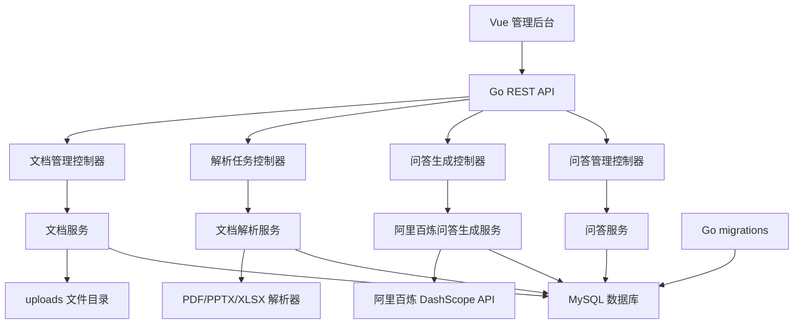
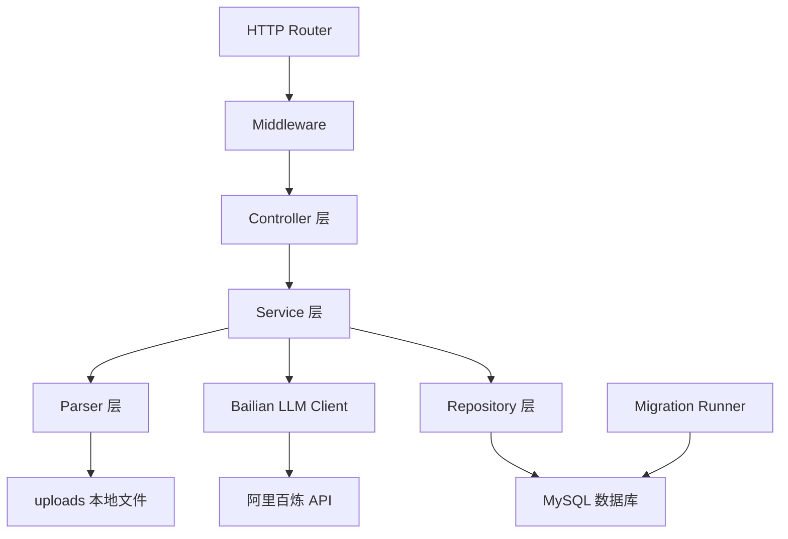
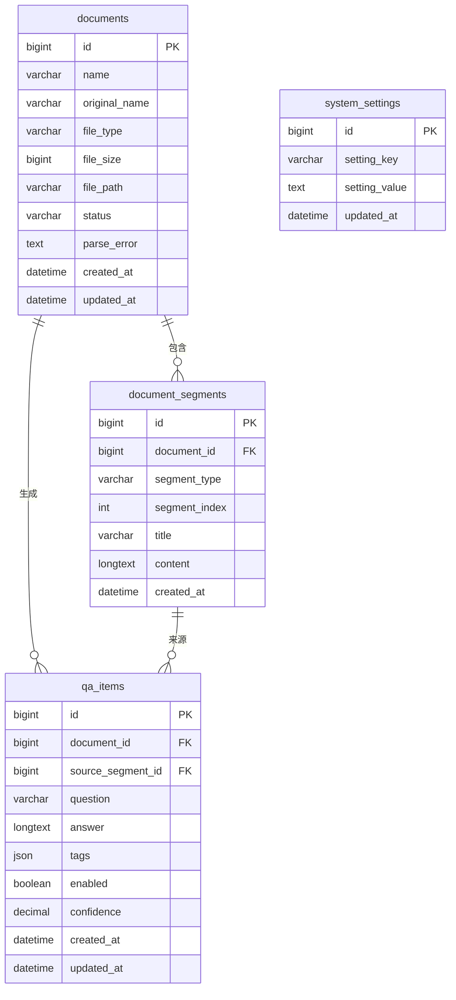

## 1. 架构设计

系统采用前后端分离架构。前端使用 Vue 构建后台管理界面，后端使用 Go 提供 REST API、文件上传、文档解析、问答生成和数据管理能力。数据层使用 MySQL 存储文档、解析片段、问答和系统设置等管理数据；数据库结构变更通过 Go migrations 管理。文件直接保存到后端 uploads 目录，并通过 docker-compose 将 uploads 挂载为持久化目录。问答生成调用阿里百炼大模型 API，API Key 仅通过环境变量注入，不写入代码或仓库文件。



## 2. 技术说明

- 前端：Vue 3 + TypeScript + Vite + Vue Router + Tailwind CSS
- 初始化工具：Vite
- 后端：Go 1.22+ + Gin + GORM
- 数据库：MySQL 8，使用 Go migrations 管理数据库结构变更
- 文件存储：后端 uploads 目录，上传文件直接保存到该目录，容器部署时挂载为持久化目录
- 文档解析：
  - PDF：使用 Go 生态解析库提取文本
  - PPTX：解析 Office Open XML 幻灯片文本内容，PPT 提示转换
  - XLSX：解析工作表、行列内容，XLS 提示转换
- 问答生成：调用阿里百炼 DashScope 兼容接口，默认模型建议使用 qwen-plus；返回结构化 JSON 问答预览
- 配置方式：通过环境变量配置 MySQL DSN、阿里百炼 API Key、模型名称、服务端口和跨域来源
- 容器部署：使用 docker-compose 编排 MySQL、Go 后端和 Vue 前端静态服务

## 3. 路由定义

| 路由 | 用途 |
|------|------|
| /dashboard | 工作台首页，展示文档和问答统计 |
| /documents | 文档管理页，上传、列表、解析状态和操作 |
| /documents/:id | 文档详情页，查看解析内容和关联问答 |
| /qa-generate | 问答生成页，选择文档并生成问答 |
| /qa | 问答管理页，查询、编辑、删除和启停问答 |
| /settings | 系统设置页，管理文件限制和生成参数 |

## 4. API 定义

### 4.1 通用响应结构

```ts
interface ApiResponse<T> {
  code: number
  message: string
  data: T
}

interface PageResponse<T> {
  list: T[]
  total: number
  page: number
  pageSize: number
}
```

### 4.2 文档接口

```ts
interface DocumentItem {
  id: number
  name: string
  originalName: string
  fileType: string
  fileSize: number
  status: 'uploaded' | 'parsing' | 'parsed' | 'failed'
  parseError?: string
  segmentCount: number
  qaCount: number
  createdAt: string
  updatedAt: string
}

interface DocumentSegment {
  id: number
  documentId: number
  segmentType: 'page' | 'slide' | 'sheet' | 'paragraph'
  segmentIndex: number
  title?: string
  content: string
}
```

| 方法 | 路径 | 说明 |
|------|------|------|
| POST | /api/documents/upload | 上传文档到 uploads 目录并创建文档记录 |
| GET | /api/documents | 分页查询文档列表 |
| GET | /api/documents/:id | 查询文档详情 |
| GET | /api/documents/:id/segments | 查询文档解析内容 |
| POST | /api/documents/:id/parse | 重新解析指定文档 |
| DELETE | /api/documents/:id | 删除文档、解析内容、关联问答和文件 |

### 4.3 问答生成接口

```ts
interface GenerateQARequest {
  documentId: number
  count: number
  difficulty: 'easy' | 'normal' | 'hard'
  overwrite: boolean
}

interface GeneratedQAItem {
  question: string
  answer: string
  sourceSegmentId?: number
  sourceExcerpt?: string
  confidence: number
}
```

| 方法 | 路径 | 说明 |
|------|------|------|
| POST | /api/qa/generate-preview | 根据指定文档调用阿里百炼生成问答预览 |
| POST | /api/qa/save-generated | 保存预览问答到问答库 |

### 4.4 问答管理接口

```ts
interface QAItem {
  id: number
  documentId: number
  documentName: string
  question: string
  answer: string
  tags: string[]
  enabled: boolean
  sourceSegmentId?: number
  createdAt: string
  updatedAt: string
}
```

| 方法 | 路径 | 说明 |
|------|------|------|
| GET | /api/qa | 分页查询问答列表 |
| GET | /api/qa/:id | 查询问答详情 |
| POST | /api/qa | 手动新增问答 |
| PUT | /api/qa/:id | 编辑问答 |
| PATCH | /api/qa/:id/status | 启用或停用问答 |
| DELETE | /api/qa/:id | 删除问答 |
| DELETE | /api/qa/batch | 批量删除问答 |

## 5. 服务端架构图



建议目录结构如下：

```text
server/
  cmd/api/main.go
  migrations/
    000001_init_schema.up.sql
    000001_init_schema.down.sql
  uploads/
web/
  src/api/
  src/router/
  src/layouts/
  src/views/
  src/components/
docker-compose.yml
.env.example
```

## 6. 数据模型

### 6.1 数据模型定义



### 6.2 数据定义语言

数据库结构由 server/migrations 下的 Go migrations SQL 文件管理。核心表包括 documents、document_segments、qa_items、system_settings，并启用 InnoDB 与 utf8mb4。

## 7. 实现边界与部署策略

- 文档原始文件直接落盘到 uploads 目录，不再按日期分层；容器部署时挂载 ./uploads:/app/uploads。
- 管理数据全部存储到 MySQL，服务启动时自动执行 migrations。
- 问答生成使用阿里百炼 API，缺少 DASHSCOPE_API_KEY 时生成接口返回明确错误。
- API Key 不进入 Git、Dockerfile、前端包或日志，仅通过 .env 或部署环境变量注入。
- 本地部署使用 docker-compose up -d 启动 MySQL、server、web 三个服务。
- PDF、PPTX、XLSX 作为优先支持格式，旧版 PPT、XLS 上传后提示转换。
